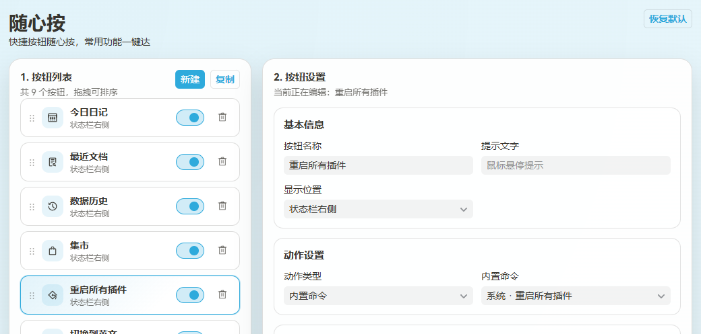
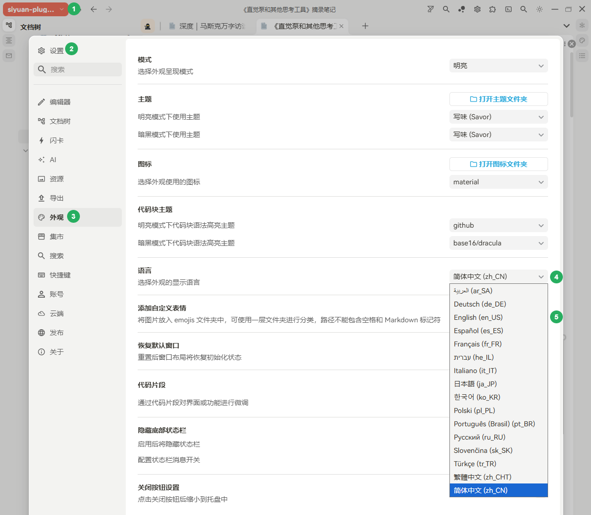
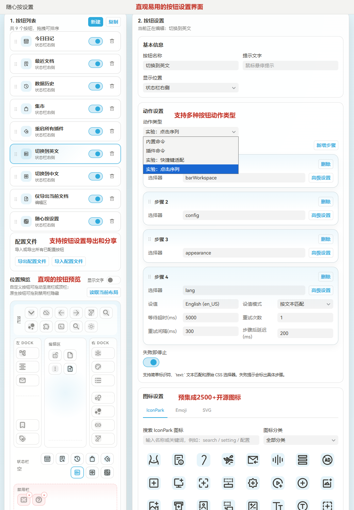

# 我想偷点懒——快捷按钮随心按，常用功能一键达

## 为什么我需要快捷按钮？

最近在开发几个插件，开发过程中需要频繁重启插件以调试最新代码，重启操作需要多步点击，进入设置-集市页面操作，操作多了我就希望有个一键直达功能：

类似的，在开发调试中英双语插件时，切换中英文界面需要 5 个点击步骤：

为了偷点懒，我希望将这些点击操作步骤自动化：

<video controls="controls" src="assets/录屏助手_20260418_100548-20260418100653-ixrwdiq.mp4"></video>

当然，每个人都会有各自日常需要快速触达一项功能的场景，有些高频操作可以通过思源笔记的快捷键设置来解决，代价是你需要记忆快捷键；还有些操作（比如上面两个场景）则无法通过快捷键完成。

如果能够将自定义操作设置为一个快捷按钮，随你心意放在你习惯的工具栏位置，应该是个不错的想法？

‍

## 快捷按钮“随心按”，常用功能一键达

偷懒不是坏事，懒惰是技术进步的驱动力。

‍
